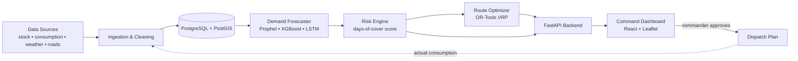

<div align="center">


<br/>


**An AI-powered command platform that predicts what each forward post will need — and plans how to deliver it, even when the road is blocked.**

[The Problem](#-the-problem) • [Our Solution](#-our-solution) • [Features](#-key-features) • [Architecture](#-architecture) • [Tech Stack](#-tech-stack) • [Getting Started](#-getting-started) • [Roadmap](#-roadmap) • [Team](#-team)

</div>

---

## 🎯 The Problem

Forward posts in remote, high-altitude and hazardous terrain depend on long supply lines. Today, resupply is largely **reactive**:

- Shortages are noticed *after* they start to hurt.
- Weather, landslides and road blocks disrupt convoys at short notice.
- Emergency runs are costly and put people at risk.
- Planners lack a single, live picture of stock levels across posts.

> **Problem Statement SIH26251** — *Indian Army: Predictive Logistics & Forward Supply Chain* (Ministry of Defence, Software, Transportation & Logistics)

## 💡 Our Solution

**RASAD-AI** closes the loop between *sensing*, *predicting*, *alerting* and *delivering*:

| Step | What happens |
|:---:|---|
| **1. Sense** | Ingest consumption, stock, troop strength, weather and road-status data |
| **2. Predict** | ML models forecast demand per post, per item, per week |
| **3. Alert** | A stock-out risk score shows *days of cover* left for every item |
| **4. Optimize** | Vehicle routing picks the best routes and loads, and re-plans around disruptions |
| **5. Learn** | Actual consumption feeds back to improve the next forecast |

## ✨ Key Features

- 📈 **Demand forecasting** for rations, fuel, ammunition and medical supplies
- 🚨 **Stock-out risk alerts** with days-of-cover and priority ranking
- 🗺️ **Disruption-aware routing** — blocked road? The plan is recalculated automatically
- ❄️ **What-if simulator** — test snowfall, landslide or road-block scenarios before they happen
- 🖥️ **Command dashboard** — map, stock levels, KPIs and AI recommendations in one view
- 📡 **Offline-first design** — built for low-bandwidth forward areas
- 🔐 **Secure by design** — on-prem / air-gapped deployment, role-based access, audit logs
- ✅ **Human in the loop** — the commander reviews and approves every AI plan

## 🏗️ Architecture



## 🧰 Tech Stack

| Layer | Technologies |
|---|---|
| **Dashboard** | React, Leaflet / OpenStreetMap (offline tiles), Chart.js |
| **Backend** | Python, FastAPI, Celery, WebSocket |
| **AI / Optimization** | Prophet, XGBoost, PyTorch (LSTM), Google OR-Tools (VRP) |
| **Data** | PostgreSQL + PostGIS, Redis |
| **DevOps & Security** | Docker, RBAC, encryption, audit logging |

## 📁 Project Structure

```
rasad-ai-predictive-logistics/
├── assets/            # banner and images
├── dashboard/         # React command dashboard
├── data/              # simulated datasets
├── docs/              # architecture, PS notes, presentation
├── src/
│   ├── forecasting/   # demand prediction models
│   ├── optimization/  # route & load optimization (OR-Tools)
│   └── api/           # FastAPI backend
├── requirements.txt
└── README.md
```

## 🚀 Getting Started

> Prototype setup. Commands will be updated as modules are added.

```bash
# 1. Clone the repository
git clone https://github.com/amrut4469-blip/rasad-ai-predictive-logistics.git
cd rasad-ai-predictive-logistics

# 2. Create a virtual environment and install dependencies
python -m venv venv
source venv/bin/activate        # Windows: venv\Scripts\activate
pip install -r requirements.txt

# 3. Run the backend (once src/api is added)
uvicorn src.api.main:app --reload
```

## 🧪 Data Note

Real Army supply data is classified. This prototype uses **synthetic, simulated data** (post names, stock levels, consumption and road events are all generated). The system is designed with **pluggable connectors**, so real data feeds can be attached securely later.

## 🛣️ Roadmap

- [ ] **Phase 1 – MVP:** simulated dataset, demand forecast, risk score, map dashboard
- [ ] **Phase 2 – Routing & Alerts:** OR-Tools routing, live alerts, automatic re-planning
- [ ] **Phase 3 – Digital Twin:** what-if simulator, explainable AI
- [ ] **Phase 4 – Scale:** multi-command rollout, integration with existing army systems

## 📊 Success Metrics

Fewer stock-outs • forecast accuracy (MAPE) • on-time delivery • lower route cost • planning time saved

## 👥 Team

**Team Bug Buster** • Team ID **139910**

| Name | Role |
|---|---|
| _Your Name_ | _Team Lead / Backend_ |
| _Member 2_ | _AI / ML_ |
| _Member 3_ | _Frontend_ |

## 📄 License

Released under the [MIT License](LICENSE).

<div align="center">

**Built for Smart India Hackathon 2026 🇮🇳**

</div>
