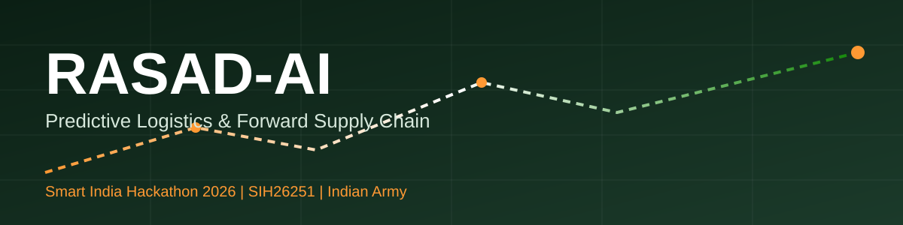
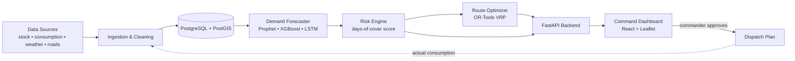

<div align="center">



<br/>


### Predict the need. Plan the delivery. Beat the blockade.

**An AI-powered command platform that forecasts what every forward post will need, ranks stock-out risk, and plans resupply routes that adapt when the road is blocked.**

[Problem](#-the-problem) • [Solution](#-our-solution) • [Features](#-key-features) • [Workflow](#-how-a-commander-uses-it) • [Architecture](#-architecture) • [Tech Stack](#-tech-stack) • [Documentation](#-documentation) • [Getting Started](#-getting-started) • [Roadmap](#-roadmap) • [Team](#-team)

</div>

---

## 🎯 The Problem

Forward posts in remote, high-altitude and hazardous terrain depend on long, fragile supply lines. Today, resupply is largely **reactive**:

* Shortages are noticed *after* they start to hurt.
* Weather, landslides and road blocks disrupt convoys at short notice.
* Emergency runs are costly and put personnel at risk.
* Planners lack a single, live picture of stock levels across posts.

> **Problem Statement SIH26251**: *Indian Army, Predictive Logistics & Forward Supply Chain*
> Ministry of Defence | Software | Transportation & Logistics

📖 **Detailed Problem Statement Documentation:**
[docs/problem-statement.md](docs/problem-statement.md)

---

## 💡 Our Solution

**RASAD-AI** closes the loop between *sensing*, *predicting*, *alerting* and *delivering*.

|       Step      | What happens                                                                     |
| :-------------: | -------------------------------------------------------------------------------- |
|   **1. Sense**  | Ingest consumption, stock, troop strength, weather and road-status data          |
|  **2. Predict** | ML models forecast demand per post, per item, per week                           |
|   **3. Alert**  | A stock-out risk score shows the **days of cover** left for every item           |
| **4. Optimize** | Vehicle routing picks the best routes and loads, and re-plans around disruptions |
|   **5. Learn**  | Actual consumption feeds back to improve the next forecast                       |

📖 **Detailed Solution Architecture:**
[docs/solution-architecture.md](docs/solution-architecture.md)

---

## ✨ Key Features

|     | Feature                      | Description                                                    |
| :-: | ---------------------------- | -------------------------------------------------------------- |
|  📈 | **Demand forecasting**       | Rations, fuel, ammunition and medical supplies, per post       |
|  🚨 | **Stock-out risk alerts**    | Days of cover and priority ranking across all posts            |
| 🗺️ | **Disruption-aware routing** | Blocked road? The plan is recalculated automatically           |
|  ❄️ | **What-if simulator**        | Test snowfall, landslide or road-block scenarios in advance    |
| 🖥️ | **Command dashboard**        | Map, stock levels, KPIs and AI recommendations in one view     |
|  📡 | **Offline-first design**     | Built for low-bandwidth forward areas                          |
|  🔐 | **Secure by design**         | On-prem / air-gapped deployment, role-based access, audit logs |
|  ✅  | **Human in the loop**        | The commander reviews and approves every AI plan               |

---

## 🧭 How a Commander Uses It

1. Open the dashboard and see every post's **days of cover** at a glance.
2. Red and amber posts are ranked by **stock-out risk**.
3. The system proposes a **dispatch plan** (routes and loads) that already accounts for weather and road status.
4. The commander **reviews, edits and approves**. The AI never acts on its own.
5. Run the **what-if simulator**: *"What if the pass closes for 5 days?"* and see the revised plan instantly.

📖 **Detailed System Workflow:**
[docs/system-workflow.md](docs/system-workflow.md)

### Risk levels

**Days of cover = current stock / forecast daily demand.** Thresholds below are illustrative defaults and are configurable per item and per post.

|   Level  | Days of cover | Meaning           |
| :------: | :-----------: | ----------------- |
| 🟢 Green |  more than 7  | Stock comfortable |
| 🟠 Amber |     3 to 7    | Schedule resupply |
|  🔴 Red  |  less than 3  | Priority dispatch |

---

## 🏗️ Architecture



📖 **Detailed Architecture Documentation:**
[docs/solution-architecture.md](docs/solution-architecture.md)

📖 **System Workflow:**
[docs/system-workflow.md](docs/system-workflow.md)

---

## 🧰 Tech Stack

| Layer                 | Technologies                                             |
| --------------------- | -------------------------------------------------------- |
| **Dashboard**         | React, Leaflet / OpenStreetMap (offline tiles), Chart.js |
| **Backend**           | Python, FastAPI, Celery, WebSocket                       |
| **AI / Optimization** | Prophet, XGBoost, PyTorch (LSTM), Google OR-Tools (VRP)  |
| **Data**              | PostgreSQL + PostGIS, Redis                              |
| **DevOps & Security** | Docker, RBAC, encryption, audit logging                  |

---

# 📚 Documentation

All major RASAD-AI technical documentation is available inside the `docs/` folder.

You can **click any file below to open it directly on GitHub**.

| Documentation                                              | Description                                                                  |
| ---------------------------------------------------------- | ---------------------------------------------------------------------------- |
| 📌 [Problem Statement](docs/problem-statement.md)          | SIH problem understanding, objectives, challenges and expected outcomes      |
| 🏗️ [Solution Architecture](docs/solution-architecture.md) | Complete system architecture and technology layers                           |
| 🔄 [System Workflow](docs/system-workflow.md)              | End-to-end RASAD-AI workflow                                                 |
| 🤖 [AI/ML Model](docs/ai-ml-model.md)                      | Demand forecasting, model pipeline, evaluation and monitoring                |
| 🗺️ [Route Optimization](docs/route-optimization.md)       | OR-Tools, VRP, constraints and disruption-aware routing                      |
| 🗄️ [Database Design](docs/database-design.md)             | PostgreSQL/PostGIS database architecture and entities                        |
| 🔌 [API Documentation](docs/api-documentation.md)          | FastAPI endpoints, authentication, validation and API architecture           |
| 🧪 [Testing Strategy](docs/testing-strategy.md)            | Unit, integration, API, ML, optimization and security testing                |
| 🔐 [Security & Responsible Use](docs/security.md)          | Authentication, authorization, secrets, security and responsible data use    |
| 🚀 [Deployment](docs/deployment.md)                        | Local setup, Docker, database, backend, frontend and deployment architecture |

### Documentation Flow

```text
Problem Statement
       ↓
Solution Architecture
       ↓
System Workflow
       ↓
AI / ML Model
       ↓
Route Optimization
       ↓
Database Design
       ↓
API Documentation
       ↓
Testing Strategy
       ↓
Security & Responsible Use
       ↓
Deployment
```

---

## 🖼️ Demo & Screenshots

> Screenshots and a demo video will be added as modules are completed.

| Command Dashboard | Stock-out Risk | What-if Simulator |
| :---------------: | :------------: | :---------------: |
|   *coming soon*   |  *coming soon* |   *coming soon*   |

---

## 🎯 Impact Targets

These are design **targets** to be validated on the prototype, not claimed results.

| Metric                  | Target                                    |
| ----------------------- | ----------------------------------------- |
| Forecast error (MAPE)   | Beat a moving-average baseline            |
| Stock-outs              | Fewer than the reactive approach          |
| Emergency resupply runs | Reduced through early alerts              |
| On-time delivery        | Improved through disruption-aware routing |
| Planning time           | Hours to minutes                          |

---

## 🔐 Security & Responsible Use

* Designed for **on-prem / air-gapped** deployment with no mandatory cloud dependency
* **Role-based access** and **audit logs** for every decision
* **Human in the loop**: the AI recommends, the commander decides
* Only **synthetic data** is used in this public repository

📖 **Full Security Documentation:**
[docs/security.md](docs/security.md)

📖 **Deployment Documentation:**
[docs/deployment.md](docs/deployment.md)

---

## 📁 Project Structure

```text
army-predictive-logistics-sih/
├── assets/                  # banner and images
├── dashboard/               # React command dashboard
├── data/                    # simulated datasets
├── docs/                    # complete project documentation
│   ├── problem-statement.md
│   ├── solution-architecture.md
│   ├── system-workflow.md
│   ├── ai-ml-model.md
│   ├── route-optimization.md
│   ├── database-design.md
│   ├── api-documentation.md
│   ├── testing-strategy.md
│   ├── security.md
│   └── deployment.md
├── src/
│   ├── forecasting/         # demand prediction models
│   ├── optimization/        # route & load optimization (OR-Tools)
│   └── api/                 # FastAPI backend
├── requirements.txt
├── LICENSE
└── README.md
```

---

## 🚀 Getting Started

> Prototype setup. Commands will be updated as modules are added.

### 1. Clone the repository

```bash
git clone https://github.com/amrut4469-blip/army-predictive-logistics-sih.git
cd army-predictive-logistics-sih
```

### 2. Create a virtual environment and install dependencies

```bash
python -m venv venv
source venv/bin/activate        # Windows: venv\Scripts\activate
pip install -r requirements.txt
```

### 3. Run the backend

> Use the backend entry point that matches the implementation currently present in `src/`.

```bash
uvicorn src.api.main:app --reload
```

### 4. Open API documentation

When FastAPI is running, the interactive API documentation is typically available at:

```text
http://127.0.0.1:8000/docs
```

For the complete API documentation, see:

[docs/api-documentation.md](docs/api-documentation.md)

### 5. Continue with deployment setup

For complete environment, database, Docker and deployment instructions:

[docs/deployment.md](docs/deployment.md)

---

## 🧪 Data Note

Real Army supply data is classified. This prototype uses **synthetic, simulated data**: post names, stock levels, consumption and road events are all generated. The system is designed with **pluggable connectors**, so real data feeds can be attached securely later.

No classified, restricted, confidential, or operationally sensitive information should be included in this public repository.

---

## 🛣️ Roadmap

* [ ] **Phase 1, MVP:** simulated dataset, demand forecast, risk score, map dashboard
* [ ] **Phase 2, Routing & Alerts:** OR-Tools routing, live alerts, automatic re-planning
* [ ] **Phase 3, Digital Twin:** what-if simulator, explainable AI
* [ ] **Phase 4, Scale:** multi-command rollout, integration with existing army systems

---

## 👥 Team

**Team Bug Buster** • Team ID **139910**

| Name             | Role      |
| ---------------- | --------- |
| Siddhant Ghode   | Team Lead |
| Anuradha Jingar  | AI / ML   |
| Rutuja Memane    | Frontend  |
| Amrut Walke      | Backend   |
| Shravani Kumbhar | Idea      |

---

## 📄 License

Released under the [MIT License](LICENSE).

<div align="center">

**Built for Smart India Hackathon 2026 🇮🇳**

</div>
